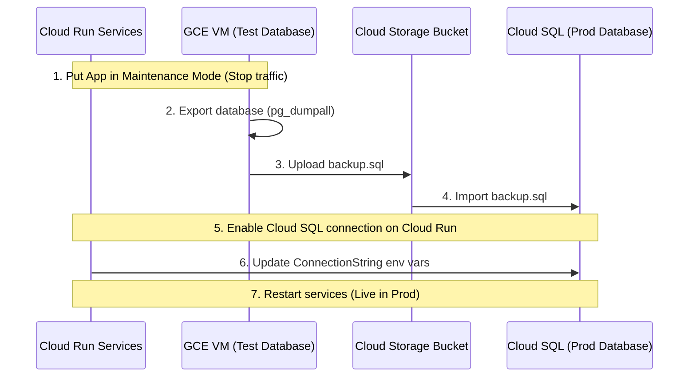

# GCP Serverless & VM Hybrid Deployment Plan

This document outlines the architecture, setup steps, and operations required to deploy the AthletIQ stack (Landing Page, Frontend, Backend, HAPI FHIR) on Google Cloud Run, using a cost-saving, VM-hosted PostgreSQL database.

---

## 1. Architecture Overview (Test Phase)

To eliminate Cloud SQL hosting costs (~$15/month) during the testing phase, we use a hybrid serverless/VM topology:
*   **App Services (Cloud Run)**: Next.js frontend, .NET API, HAPI FHIR, and landing page are deployed to Cloud Run (automatically scaling to zero when idle for $0 cost).
*   **Database (Compute Engine VM)**: PostgreSQL runs in a standard Docker container on a tiny `e2-micro` instance. This instance is **100% free** under the GCP Free Tier (when deployed in `us-central1`, `us-east1`, or `us-west1`).
*   **Private Networking (Direct VPC Egress)**: Cloud Run services connect directly to the VM's private IP address over your internal VPC network for free (without paying for Serverless VPC Access Connectors).

```mermaid
graph TD
    User([User / Browser]) --> DomainMappings{Cloud Run Custom Domains}
    DomainMappings -->|athletiq.one| Landing[Cloud Run: Landing Page]
    DomainMappings -->|athletiq.team| Frontend[Cloud Run: Next.js Frontend]
    DomainMappings -->|api.athletiq.one| API[Cloud Run: .NET API]
    API --> FHIR[Cloud Run: HAPI FHIR]
    
    subgraph VPC Network (Default)
        API -->|Private IP: Port 5432 via Direct VPC Egress| PostgresContainer[Docker Container: PostgreSQL 17]
        FHIR -->|Private IP: Port 5432 via Direct VPC Egress| PostgresContainer
        
        subgraph e2-micro VM Instance (GCP Free Tier)
            PostgresContainer -->|Docker Volume| PersistentDisk[(30 GB Persistent Disk)]
        end
    end
```

---

## 2. Step-by-Step Operations & Setup Guide

### Step 1: Run the GCP Setup Script
1.  Authenticate with your Google Cloud account:
    ```bash
    gcloud auth login
    ```
2.  Navigate to your deployment scripts directory and run the automatic setup script:
    ```bash
    cd AthletIQ-Deploy
    # Set your custom GCP Project ID and Region
    GCP_PROJECT_ID="your-project-id" GCP_REGION="us-central1" ./scripts/setup-gcp-infrastructure.sh
    ```
    *Note: The script enables the required APIs, provisions the free-tier database VM, creates the Artifact Registry docker repository, sets up Workload Identity Federation (WIF) for secure GitHub deployment, and outputs randomly generated passwords.*

### Step 2: Configure GitHub Secrets & Variables
In each of your GitHub repositories (**AthletIQ-Backend**, **AthletIQ-frontend**, **AthletIQ-Landingpage**), add the following:

**Variables (`vars`):**
*   `GCP_PROJECT_ID`: Your GCP project ID.
*   `GCP_REGION`: The region used (e.g., `us-central1`).
*   `HAPI_FHIR_URL`: *(Leave blank or set to a placeholder until HAPI is deployed)*.
*   `NEXT_PUBLIC_API_BASE_URL`: *(Leave blank or set to a placeholder until the backend API is deployed)*.
*   `BACKEND_URL`: *(Leave blank or set to a placeholder until the backend API is deployed)*.

**Secrets (`secrets`):**
*   `GCP_WIF_PROVIDER`: The workload identity provider resource URI.
*   `GCP_WIF_SERVICE_ACCOUNT`: The deployment service account email.
*   `GCP_CLOUDSQL_CONNECTION_NAME`: The database connection identifier.
*   `DB_PASSWORD`: Password for the `athletiq` database user.
*   `HAPI_DB_PASSWORD`: Password for the `hapi` database user.
*   `JWT_SECRET`: A secure 32+ character random secret string for JWT token signatures.

### Step 3: Deploy HAPI FHIR
Since HAPI FHIR uses a public, pre-built image, deploy it directly using the helper script:
```bash
GCP_PROJECT_ID="your-project-id" GCP_REGION="us-central1" GCP_CLOUDSQL_CONNECTION_NAME="your-connection-name" HAPI_DB_PASSWORD="your-db-password" ./scripts/deploy-hapi-fhir.sh
```
Save the resulting Cloud Run URL (e.g., `https://hapi-fhir-xxxx.run.app`). Update `HAPI_FHIR_URL` in the GitHub Variables for your Backend repository to this URL.

### Step 4: Deploy the Backend API
1.  Commit and push the `.github/workflows/deploy-backend.yml` workflow file to the backend repository.
2.  Navigate to the **Actions** tab in GitHub, select **Deploy Backend API to Cloud Run**, click **Run workflow**, and run it.
3.  Copy the resulting Backend Cloud Run URL (e.g., `https://athletiq-api-xxxx.run.app`). Update the `NEXT_PUBLIC_API_BASE_URL` and `BACKEND_URL` variables in the Frontend repository to this URL.

### Step 5: Deploy Frontend & Landing Page
1.  Commit and push the workflows for the frontend and landing page repositories.
2.  Trigger the **Deploy Frontend** and **Deploy Landing Page** workflows via the GitHub Actions tab.

---

## 3. Custom Domains & SSL Setup (athletiq.one / athletiq.team)

Cloud Run manages Let's Encrypt certificates and auto-renews them automatically for free.

### Direct Subdomain Mappings
Map your custom domains to their respective Cloud Run services:
*   `https://athletiq.one` and `www.athletiq.one` $\rightarrow$ Map to `athletiq-landing`
*   `https://athletiq.team` and `www.athletiq.team` $\rightarrow$ Map to `athletiq-frontend`
*   `https://api.athletiq.one` and `api.athletiq.team` $\rightarrow$ Map to `athletiq-api`

#### Setup steps:
1.  Go to the **Cloud Run** page in your GCP Console.
2.  Click **Manage Custom Domains** at the top $\rightarrow$ **Add Mapping**.
3.  Select the target service (e.g. `athletiq-frontend`) and enter the custom domain (e.g. `app.athletiq.team`).
4.  Configure the DNS records provided by GCP at your domain registrar (e.g. one.com, Cloudflare). SSL activation takes 15-30 minutes.

---

## 4. Production Migration Roadmap (Switching to Cloud SQL)

When transitioning to production, follow these steps to migrate your database from the VM container to a fully-managed Cloud SQL instance:



1.  **Deploy Cloud SQL**: Provision a production-ready Cloud SQL PostgreSQL instance (e.g., db-custom-2-7680, High Availability, Automatic Backups).
2.  **Export Current Data**:
    SSH into the GCE VM and export your databases:
    ```bash
    docker exec -t athletiq_postgres pg_dumpall -U athletiq > backup.sql
    ```
3.  **Upload & Import**:
    *   Upload `backup.sql` to a secure GCP Cloud Storage bucket.
    *   Use the GCP Console or `gcloud sql import` to import `backup.sql` directly into your new Cloud SQL instance.
4.  **Reconfigure Cloud Run Services**:
    *   Remove the Direct VPC Egress flags (`--network` and `--vpc-egress`) if not using a private VPC for Cloud SQL.
    *   Attach Cloud SQL connection flag: `--add-cloudsql-instances=<CONNECTION_NAME>`.
    *   Update the `ConnectionStrings__DefaultConnection` environment variable to point to the Unix socket (or Cloud SQL proxy port).
5.  **Deprovision the VM**: Tear down the GCE VM to stop any future costs or maintenance.
